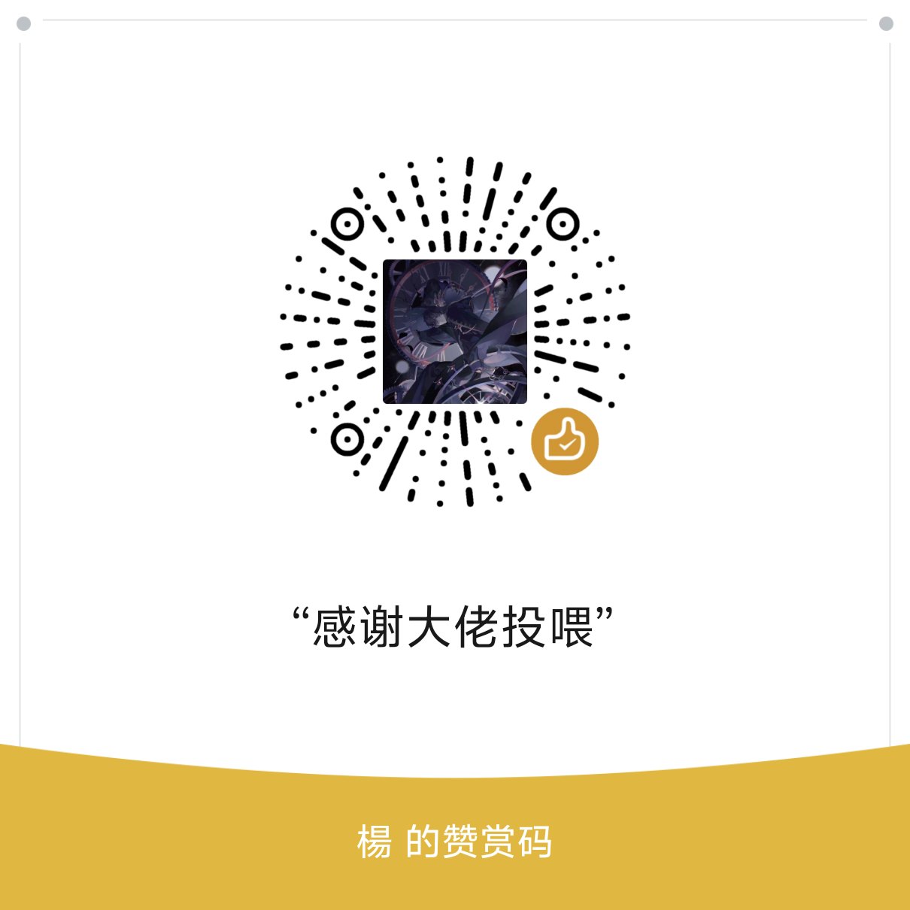

# AFK Journey 启程自动化助手（梅林初号机）

基于图像模板匹配的《剑与远征：启程》日常任务自动化工具。通过截图 + 模板匹配定位界面元素，
配合 AutoHotkey 注入点击，自动完成登录、月卡/礼包领取、主线推进、迷宫、推图、爬塔、好友赠送、
邮件、挂机等循环任务。

本项目（`schalkiii/afk-journey-merlin-auto`）基于上游 `yangyh02/afk-journey-merlin-auto` 二次开发，
在保留原项目功能的基础上做了一系列增强（见下文「本仓库相较于上游的增强」）。

---

## 功能特性

| 功能 | 说明 |
| --- | --- |
| 任务总开关 | 单一「开始运行 (F8) / 停止运行 (F9)」按钮，避免多个停止按钮的混乱 |
| 立即开始 | 一键「立即开始」：启动游戏（若未运行）+ 立即运行脚本 |
| 定时开始 | 设定每天固定时间启动；触发时**自动检测游戏是否已运行**，已运行则直接运行脚本，避免重复拉起游戏 |
| 自动运行 | 勾选「运行成功后自动运行」后，每次运行结束自动重新启动循环 |
| 启动后自动运行 | 勾选「启动后自动运行」后，App 启动即开始运行（无需手动点开始） |
| 启动游戏 | 勾选「启动时启动游戏」后，定时/立即开始会先通过桌面快捷方式启动游戏，等待指定秒数后再运行脚本 |
| 游戏启动等待 | 可设置游戏启动后的等待时间（秒），支持手动输入并自动保存 |
| 全局热键 | F8 开始运行、F9 停止运行（即使窗口未聚焦也生效） |
| 检查更新 | 菜单「帮助 → 检查更新」对比本地 `version.py` 与远程 `version.json`，支持下载并自动替换 exe |
| 配置持久化 | 所有勾选项、等待时间、定时设置均写入 `game_bot_config.json`，下次启动自动恢复 |

---

## 本仓库相较于上游的增强

> 以下改动均为本仓库（schalkiii fork）新增，**上游原项目不含这些能力**。

### 1. 自动配置通关阵容（一键采用系统推荐阵容）

- 新增共享能力 `common.try_auto_configure_lineup()`：挑战/战斗前自动检测「通关阵容」入口
  （`templates/tongguanzhenrong.png`）并点击展开，再点击「一键采用」（`templates/yijiancaiyong.png`）
  套用系统推荐阵容，省去手动布阵。
- **容错**：若展开后找不到「一键采用」，则点击「点击空白处关闭」（`dianjikongbaichuguanbi.png`）
  退出阵容视图，避免卡死——与 `flow_tower` / `haoyoujiangli` 等其它流程退出阵容界面的方式一致。
- **GUI 开关**：控制栏新增「自动配置通关阵容」复选框，状态持久化到 `game_bot_config.json`
  （键 `auto_configure_lineup`）。
- **接入点**：迷梦之域（`mimengzhiyu.flow_mimengzhiyu`）与女神塔（`nvshenta.flow_nvshenta`）在每次点击战斗前
  会读取该开关，开启时自动尝试采用阵容；未检测到入口则静默跳过，不影响原有挑战流程。
- **健壮性**：采用前会**重试多次**（默认 3 次）以兼容挑战界面刚进入时的加载/动画延迟；
  展开后若找不到「一键采用」，依次尝试「点击空白处关闭」（`dianjikongbaichuguanbi`）、
  再**点击屏幕空白处兜底**，确保退出阵容视图、不卡死。
- 新增模板：`templates/tongguanzhenrong.png`、`templates/yijiancaiyong.png`。

### 2. 一键全选（批量勾选功能）

- 脚本面板「开启」勾选框旁新增「一键全选」按钮，调用 `GameBotGUI.enable_all_scripts()`：
  一次性将全部功能脚本置为启用，刷新当前面板勾选框与列表 `✓` 标记，并持久化到配置。
- 便于每天启动后快速勾选所有功能，省去逐个勾选。

### 3. F9 立即停止（协作式停止）

- 新增底层机制：`common.StopRequested`（继承 `BaseException`，避免被子脚本 `except Exception` 吞掉）、
  `set_stop_checker()`、`check_stop()`，并将停止检查注入 `screenshot_bgr()`、`send_coord()`、`wait_and_click()`
  等所有子脚本共用的底层原语。
- 效果：按下 F9 后，运行循环置位 `stop_event`，子脚本在**下一次截图/点击**即抛出 `StopRequested` 被立即中断，
  无需等待脚本自然跑完。运行循环捕获该异常后将脚本标记为「已停止」并退出。
- 相比上游「等当前脚本结束才停」，本改动让停止真正即时。

### 4. 子脚本日志汇聚到运行日志面板

- 新增 `common.log()` / `set_log_sink()`：子脚本统一调用 `log(...)`，未设置汇聚时回退到标准输出（便于单独调试）。
- GUI 通过 `_StdoutTee` + `_panel_log` 把子脚本的 `print(...)` 调试日志实时转发到应用内「运行日志」面板，
  线程安全（经 `root.after` 调度到主线程写入），便于排错。

### 5. 启动性能优化：复用常驻进程 + 隐藏控制台窗口

- 每次点「开始运行」不再盲目重启 `click_from_file.exe`：新增 `is_click_from_file_running()`（用 `tasklist`
  探测），若常驻监听进程已在运行则**直接复用**，跳过重启与 `sleep`，消除约 1 秒卡顿与弹出的新终端黑框。
- 仅当进程未运行时才启动，并使用 `subprocess.CREATE_NO_WINDOW` 隐藏控制台窗口——首次启动也不再可见黑框。

### 6. 流程健壮性：统一返回主界面 & 结算弹窗清理

- **`common.find_center_silent()` 上移并增强**：原本 `flow_tower` / `nvshenta` / `pata` / `pujing` / `mimengzhiyu`
  各自重复实现的静默版 `find_center` 已去重，统一为 `common` 中的实现，并新增 `region` 参数（限定搜索范围加速）。
- **`flow_enter.flow_return_main()` 新增**：经若干次「返回(exit) / 点击空白处关闭」回到游戏主界面
  （以 `wanfamulu` 可见为判定）。任务结束后统一回到起点，避免停留在社交/好友/玩法子界面导致后续任务卡死。
  `mimengzhiyu` 与 `haoyoujiangli` 均已接入。若两者都检测不到（既无返回按钮也无空白关闭），
  则**点击屏幕空白处兜底**尝试退出弹窗。
- **迷梦之域（mimengzhiyu）增强**：
  - 新增 `close_result_popups()`：循环点击「点击空白处关闭」清掉结算/奖励弹窗，避免卡在结算界面；
    连续 2 秒检测不到「点击空白处关闭」时，**点击屏幕空白处兜底**关闭残留弹窗；
  - `handle_battle()` 战斗中轮询 `tiaoguozhandou` 并点击快进（解决首次无预跳过需观战的问题）；
  - 每轮结束与次数用尽后清理弹窗并 `flow_return_main()` 回到主界面。
- **好友奖励（haoyoujiangli）重写**：补充分层日志、`_close_popups()` 弹窗清理、对 `exitck` / `exit` 缺失的容错，
- **战斗任务失败 / 任务间弹窗统一兜底**：新增 `common.dismiss_popup()`——优先点击「点击空白处关闭」
  （`dianjikongbaichuguanbi`）模板关闭弹窗，检测不到再**点击屏幕空白处兜底**。在任务调度循环
  （`Goldenhandmaidens.run_scripts_thread` 的 `for script_name in script_order` 每次进入任务前）统一调用，
  因此**所有战斗类任务**（迷梦之域 / 女神塔 / 普竞 / 爬塔 / 推图 / 幻灵推图 / 异界迷宫等）失败残留的弹窗
  都会在下一任务开始前被清理；同时覆盖「任务结束后弹出礼包广告」的场景，避免残留弹窗卡死后续任务。
  结尾兜底清理弹窗并 `flow_return_main()` 回到主界面；移除原 `__main__` 独立调试入口。
- **卡死自动兜底回主界面（防连锁卡死）**：新增 `common.recover_to_main_interface()` 与 `common.ensure_main_interface()`。
  - `recover_to_main_interface()`：任务卡在某界面（弹窗 / 子界面）反复检测不到目标时，依次尝试点击
    「点击空白处关闭」(`dianjikongbaichuguanbi`) / `tuichulibao` / `exitck` / `exit` 逐层退出，直到主界面
    `wanfamulu` 可见，无任何退出按钮时点击屏幕空白处兜底。`flow_return_main()` 现已复用此逻辑。
  - `wait_and_click()` 新增 `recover_threshold` 参数：某目标**连续检测失败达到该次数（默认关闭）**即自动触发
    一次兜底回主界面、从卡住处退出后继续等待目标，实现「反复检测不到 → 兜底退出 → 重新继续当前任务」。
    各任务入口的 `wanfamulu` 检测已启用 `recover_threshold=20`。
  - `ensure_main_interface()`：在每个任务开始前（除「登录」外）调用，先 `dismiss_popup()` 关闭残留弹窗，
    再确保已回到主界面；即使上一任务卡在子界面未退出，本次 `wanfamulu` 检测也能正常进行，避免连锁卡死后续所有任务。

### 7. 命令行启动游戏 + 联动启动脚本（`launch_game.py`）

- 新增 `launch_game.py`：读取桌面「剑与远征：启程」`.lnk` 快捷方式的目标路径与参数，用同样命令直接拉起游戏
  （绕过启动器，等价于代码代替双击）。
- 用法：
  ```bash
  python launch_game.py                 # 仅启动游戏
  python launch_game.py --bot           # 启动游戏 + 启动本项目脚本(GUI)
  python launch_game.py --bot --delay 5 # 启动游戏，等待 5 秒后启动脚本
  ```
- 若快捷方式指向游戏本体 exe（带 `--env_id` 等参数）则直接进游戏；若只指向启动器则仍打开启动器。

### 8. 其它清理与去重

- `get_resource_path` / `get_work_path` 统一下沉到 `common`，GUI 改为从 `common` 导入，避免重复定义。
- `_ensure_config_files()` 简化为仅确保 `shared` 目录存在（移除已无用的空拷贝循环）。
- `goldenhandmaidens.spec` 的 `hiddenimports` 补充 `flow_enter`，确保打包后导入无误。
- 新增 `config.json`（启动器/脚本的默认配置）。

### 9. 工程化增强：识别去重 / 截屏缓存 / 依赖自动收集 / 测试基线

- **英雄识别逻辑统一（消除多份实现分叉）**：上游/原仓库在 `warehouse` / `flow_tower` / `push` 中各自维护一份 `_recognize_hero` 与底层 `_best_multiscale_match_score` / `_iter_scales`，三份的裁切区域与尺度范围并不一致（仓库扫描用上半 60% 裁切 + `HERO_TEMPLATE_SCALE_*`，阵容识别用整卡 + `LINEUP_HERO_TEMPLATE_SCALE_*`），存在“仓库练度判定”与“阵容识别”结果相互矛盾的隐患。现已抽出统一的 `warehouse._match_best_hero(face_roi, scale_min, scale_max, scale_step)`，由各入口按界面传入对应尺度范围与阈值——**匹配算法单源、行为完全不变**，彻底消除分叉。
- **截屏缓存下沉到 `screenshot_bgr`**：原先缓存仅作用于模板匹配（`get_cached_screenshot`），英雄识别循环仍每次全屏截屏。现在缓存逻辑内置进 `screenshot_bgr` 本身（短 TTL 0.05s，且每次仍调用 `check_stop` 保证 F9 即时中断），并在 `wait_and_click` 点击后调用 `invalidate_screenshot_cache()` 使下一帧为最新——长任务（推图/爬塔/迷宫）的重复截屏开销显著降低。
- **`goldenhandmaidens.spec` 的 `hiddenimports` 改为自动收集**：原先新增一个 flow 脚本需手改 spec 的模块清单（漏改会导致打包后 `ImportError`）。现改为 `glob` 自动收集项目内所有顶层脚本模块，仅 `certifi` / `keyboard` 等第三方包仍显式列出——新增任务脚本后打包零额外配置。
- **测试基线**：新增 `tests/test_smoke.py`（pytest），覆盖全部模块可导入 + 阵容可采纳判定 `_is_lineup_acceptable` 的核心逻辑，为后续重构提供回归保护。
- 另对全仓做了 ruff 机械整改（未用 import / 死代码 / 简化），并修复 `flow_migong` 中 lambda 延迟绑定循环变量的隐患（B023）。

---

## 运行环境

- **操作系统**：Windows（依赖 `user32`/`shell32` 窗口管理与 AHK 注入）
- **屏幕分辨率**：1600×900、横向（模板基于此分辨率采集）
- **Python**：3.10+（仅开发/源码运行需要；普通用户直接运行打包好的 `goldenhandmaidens.exe`）
- **依赖组件**：
  - `click_from_file.exe` / AutoHotkey：负责实际鼠标点击注入（由 `common.send_coord` 写入坐标文件驱动）
  - 桌面《剑与远征：启程》快捷方式：用于「启动游戏」/ `launch_game.py`
  - `templates/` 目录：界面元素模板图片（含新增 `tongguanzhenrong.png`、`yijiancaiyong.png` 等）

---

## 快速开始

1. 以**管理员身份**运行 `goldenhandmaidens.exe`（点击注入需要管理员权限）。
2. （可选）勾选控制栏「自动配置通关阵容」，让迷梦之域等挑战前自动采用系统推荐阵容。
3. 在「功能选择」面板勾选需要执行的任务；可点「一键全选」批量启用。
4. 点击「开始运行 (F8)」启动脚本；运行中点击「停止运行 (F9)」可立即中断所有子脚本。
5. 如需定时运行：在「定时开始」处设置小时/分钟 → 点击「设定定时」；到点将自动检测游戏状态并运行。
6. 如需一键启动游戏 + 脚本：点击「立即开始」，或命令行 `python launch_game.py --bot`。

> 提示：脚本运行依赖**游戏窗口在前台**（标题含「剑与远征：启程」）。定时/立即开始会在脚本启动前自动将游戏窗口切换到前台，
> 否则模板匹配会找不到界面而失效。

---

## 项目结构

```
Goldenhandmaidens.py      主程序：tkinter GUI、热键、定时/立即运行、配置持久化、日志汇聚、协作式停止
common.py                 基础能力：模板匹配(find_center/find_center_silent)、坐标 IPC、协作式停止、日志汇聚、自动配置阵容
start.py                  启动任务：登录、月卡/礼包弹窗处理（被「运行登录」调用）
flow_enter.py             进入游戏 / 返回主界面(flow_return_main)
flow_migong.py            迷宫探索（含小地图特征匹配加速）
flow_push.py              推图流程
flow_tower.py             爬塔流程
mimengzhiyu.py           迷梦之域挑战（接入自动配置阵容、结算弹窗清理、返回主界面）
haoyoujiangli.py          好友赠送（重写：弹窗清理 + 容错退出 + 返回主界面）
formation.py              阵容编辑（读取 formations.json 配置上阵英雄）
hero_metadata.py          英雄元数据（ID / 位置 / 模板）
drag_utils.py             拖拽 / 滑动工具
warehouse.py              仓库相关
updater.py                检查更新与自更新
version.py                本地版本号
launch_game.py            命令行启动游戏并可联动启动本项目脚本（新增）
click_from_file.exe       AHK 注入器（读取坐标文件执行点击）
templates/                界面模板图片
game_bot_config.json      用户配置（运行时生成）
config.json               启动器/脚本默认配置（新增）
```

---

## 代码规范

为保证跨模块一致性，约定如下（详见各文件头部模块文档）：

1. **模块文档**：每个 `.py` 顶部含模块级 docstring，说明「功能 / 关键接口 / 依赖」。
2. **注释讲「为什么」**：复杂或反直觉的逻辑（如 IPC 用文件而非直接控制、匹配阈值选取、协作式停止为何用 BaseException）需写明原因。
3. **命名语义化**：避免单字母或 ≤3 字符且无明确含义的命名（如 `res` → `match_result`）；
   模板路径/坐标等变量的命名需能反映用途；GUI 控件变量以 `_var` 后缀、控件以 `_btn`/`_frame` 等后缀。
4. **复用优先**：跨任务重复的「检测并点击」「静默匹配」「返回主界面」「弹窗清理」逻辑统一下沉到 `common.py` / `flow_enter.py`，
   避免各模块各自实现（如已去重的 `find_center_silent`、新增的 `flow_return_main` 与 `try_auto_configure_lineup`）。
5. **配置与代码分离**：用户可配置项经 `save_config()` 持久化，不在代码中硬编码开关（如 `auto_configure_lineup`）。

---

## 二次开发（源码运行）

```bash
pip install pyautogui opencv-python numpy pillow requests
python Goldenhandmaidens.py
```
打包为单文件 exe（输出到仓库根目录）：
```bash
pyinstaller goldenhandmaidens.spec --distpath . --workpath build --noconfirm
```

A: 请确保 shared 文件夹已创建，启动时需要当前界面可以看到玩法目录四个字，在其他界面无法顺利运行。

A: 手动退出到玩法目录界面，重新启动程序。

Q: 识别不到按钮？

A: 请检查游戏分辨率是否正确，界面是否与模板匹配。

Q: 如何停止正在运行的任务？

A: 点击界面上的「停止运行」按钮。

Q: 异界迷宫自动退出？
A: 请检查你使用阵容所需的角色是否已经准备好。

Q: 异界迷宫boss阵容缺失？

A: 主包不更新我也没办法，随便拿个阵容凑合用吧，支持催更若隐寒星和千秋月。

### 7.开发相关
计划更新家园愿望单相关内容和荣誉对决。

### 8.致谢
- **异界迷宫烙印选择策略来自** B站 若隐寒星/frosty（https://space.bilibili.com/401793216）

- **异界迷宫阵容参考来自** B站 千秋月（https://space.bilibili.com/3546777955338480）

### 9.赞助
- **如果你觉得这个工具具有帮助，欢迎赞助支持❤️**



### 10.免责声明
- **本工具仅供学习交流使用，请勿用于任何商业用途。使用本工具产生的任何后果由用户自行承担。**

### 许可证
MIT License

> 注：`goldenhandmaidens.spec` 已将 `templates/`、`click_from_file.exe`、各 `*.json` 配置及 `flow_enter` 等模块一并打进 exe，新增模板/模块后无需手动修改资源清单。
